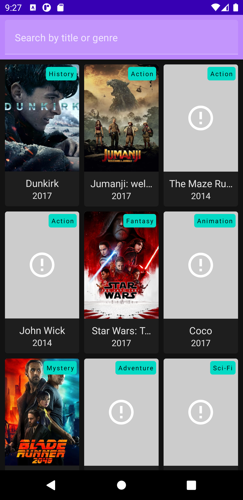

# Movies Compose
A simple application that retrieves and displays a list of movies. Using Clean Arhcitecture MVI
with a Jetpack Compose-based view layer (**Jetpack Compose is not ready for production yet, this
was created as an experiment and for personal development.**)

## Screenshots
#### Portrait


#### Landscape


#### Portrait - Filter by name


#### Portrait - Filter by genre


#### Dark mode


## Languages, Libraries & Tools
* [Kotlin](https://kotlinlang.org/)
* [Jetpack Compose](https://developer.android.com/jetpack/compose)
* [Android Architecture Components - ViewModel](https://developer.android.com/topic/libraries/architecture/viewmodel.html)
* [Retrofit](https://square.github.io/retrofit/)
* [Accompanist - Glide](https://chrisbanes.github.io/accompanist/glide/)
* [Glide](https://github.com/bumptech/glide)
* [Dagger 2 w/ Hilt](http://google.github.io/dagger/)
* [Ktlint Gradle](https://github.com/JLLeitschuh/ktlint-gradle)

## License
```
Copyright 2021 Robert Eggar.

Licensed under the Apache License, Version 2.0 (the "License");
you may not use this file except in compliance with the License.
You may obtain a copy of the License at

    http://www.apache.org/licenses/LICENSE-2.0

Unless required by applicable law or agreed to in writing, software
distributed under the License is distributed on an "AS IS" BASIS,
WITHOUT WARRANTIES OR CONDITIONS OF ANY KIND, either express or implied.
See the License for the specific language governing permissions and
limitations under the License.
```